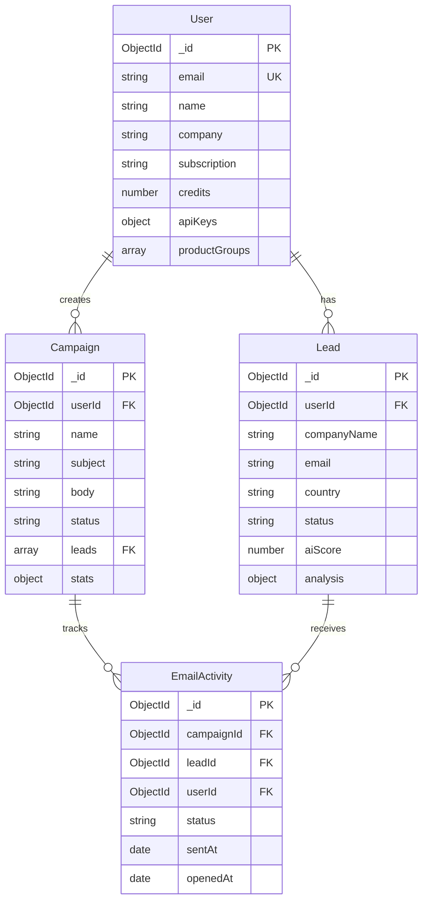

# ExportHunter Backend Architecture

## Executive Summary

ExportHunter is a B2B lead generation and email campaign platform for exporters. This document outlines the current architecture, identifies improvements, and provides a roadmap for scalability.

---

## 1. Current Architecture Analysis

### 1.1 System Overview

**Technology Stack:**
- **Runtime:** Node.js with TypeScript
- **Framework:** Express.js
- **Database:** MongoDB (Mongoose ODM)
- **AI Services:** Google Gemini API
- **Email Service:** Resend
- **Payment:** Stripe
- **Authentication:** JWT

**Architecture Pattern:** Monolithic MVC with service layer

### 1.2 Service Boundaries (Current)

```
┌─────────────────────────────────────────────────────────┐
│                    Express Server                       │
│  ┌──────────┐  ┌──────────┐  ┌──────────┐            │
│  │  Routes  │→ │Controllers│→ │ Services │            │
│  └──────────┘  └──────────┘  └──────────┘            │
│       │              │              │                  │
│       └──────────────┴──────────────┘                  │
│                        │                                │
└────────────────────────┼────────────────────────────────┘
                         │
         ┌───────────────┼───────────────┐
         │               │               │
    ┌────▼────┐    ┌────▼────┐    ┌────▼────┐
    │ MongoDB │    │ Gemini  │    │ Resend  │
    └─────────┘    └─────────┘    └─────────┘
```

### 1.3 Current API Structure

**Base URL:** `/api`

| Resource | Endpoints | Auth Required |
|----------|-----------|--------------|
| `/auth` | POST `/register`, `/login` | No |
| `/leads` | GET `/`, POST `/`, PUT `/:id`, DELETE `/:id`, POST `/hunt`, GET `/stats` | Yes |
| `/campaigns` | GET `/`, POST `/`, POST `/:id/send`, GET `/:id/stats` | Yes |
| `/ai` | POST `/discover`, `/generate-email`, `/analyze` | Yes |
| `/track` | GET `/open/:campaignId/:leadId`, `/click/:campaignId/:leadId` | No |
| `/stats` | GET `/dashboard` | Yes |
| `/payment` | POST `/webhook`, `/create-checkout` | Mixed |
| `/upload` | POST `/logo` | Yes |

---

## 2. API Design Improvements

### 2.1 API Versioning

**Current Issue:** No versioning strategy

**Recommendation:** Implement `/api/v1/` prefix

```typescript
// server.ts
app.use('/api/v1/auth', authRouter);
app.use('/api/v1/leads', leadsRouter);
// ... etc
```

**Benefits:**
- Backward compatibility
- Gradual migration path
- Clear deprecation strategy

### 2.2 Standardized Response Format

**Current Issue:** Inconsistent response structures

**Recommendation:** Create response utility

```typescript
// src/utils/response.ts
export class ApiResponse {
  static success<T>(data: T, message?: string) {
    return {
      success: true,
      data,
      message,
      timestamp: new Date().toISOString()
    };
  }

  static error(message: string, code?: string, details?: any) {
    return {
      success: false,
      error: {
        message,
        code,
        details
      },
      timestamp: new Date().toISOString()
    };
  }

  static paginated<T>(items: T[], pagination: PaginationMeta) {
    return {
      success: true,
      data: items,
      pagination,
      timestamp: new Date().toISOString()
    };
  }
}
```

### 2.3 Error Handling Enhancement

**Current Issue:** Basic error handler, no error codes

**Recommendation:** Structured error classes

```typescript
// src/utils/errors.ts
export class AppError extends Error {
  constructor(
    public statusCode: number,
    public message: string,
    public code: string,
    public isOperational = true
  ) {
    super(message);
    Error.captureStackTrace(this, this.constructor);
  }
}

export class ValidationError extends AppError {
  constructor(message: string, public fields?: Record<string, string[]>) {
    super(400, message, 'VALIDATION_ERROR');
  }
}

export class NotFoundError extends AppError {
  constructor(resource: string) {
    super(404, `${resource} not found`, 'NOT_FOUND');
  }
}

export class UnauthorizedError extends AppError {
  constructor(message = 'Unauthorized') {
    super(401, message, 'UNAUTHORIZED');
  }
}
```

**Enhanced Error Handler:**

```typescript
// src/middleware/errorHandler.ts
export const errorHandler = (
  error: any,
  req: Request,
  res: Response,
  next: NextFunction
) => {
  if (error instanceof AppError) {
    return res.status(error.statusCode).json({
      success: false,
      error: {
        message: error.message,
        code: error.code,
        ...(error instanceof ValidationError && { fields: error.fields })
      },
      timestamp: new Date().toISOString()
    });
  }

  // Log unexpected errors
  console.error('Unexpected Error:', error);

  res.status(500).json({
    success: false,
    error: {
      message: process.env.NODE_ENV === 'production' 
        ? 'Internal server error' 
        : error.message,
      code: 'INTERNAL_ERROR'
    },
    timestamp: new Date().toISOString()
  });
};
```

### 2.4 Request Validation

**Current Issue:** No request validation layer

**Recommendation:** Use Zod for schema validation

```typescript
// src/middleware/validate.ts
import { z, ZodSchema } from 'zod';
import { Request, Response, NextFunction } from 'express';
import { ValidationError } from '../utils/errors';

export const validate = (schema: ZodSchema) => {
  return (req: Request, res: Response, next: NextFunction) => {
    try {
      schema.parse({
        body: req.body,
        query: req.query,
        params: req.params
      });
      next();
    } catch (error) {
      if (error instanceof z.ZodError) {
        const fields = error.errors.reduce((acc, err) => {
          const path = err.path.join('.');
          if (!acc[path]) acc[path] = [];
          acc[path].push(err.message);
          return acc;
        }, {} as Record<string, string[]>);
        
        throw new ValidationError('Validation failed', fields);
      }
      next(error);
    }
  };
};

// Usage example:
// src/routes/leads.ts
import { z } from 'zod';

const createLeadSchema = z.object({
  body: z.object({
    companyName: z.string().min(1),
    email: z.string().email(),
    country: z.string().min(2),
    industry: z.string().min(1)
  })
});

router.post('/', validate(createLeadSchema), createLead);
```

---

## 3. Database Schema Optimization

### 3.1 Current Schema Analysis

**Strengths:**
- Proper indexing on `userId` and `status`
- Timestamps enabled
- References properly defined

**Issues:**
1. Missing compound indexes for common queries
2. No TTL indexes for temporary data
3. Large embedded objects (analysis, supplyChainIntel) could impact performance
4. No database-level constraints

### 3.2 Recommended Indexes

```typescript
// Lead Model - Enhanced Indexes
leadSchema.index({ userId: 1, status: 1, aiScore: -1 }); // Common query pattern
leadSchema.index({ userId: 1, createdAt: -1 }); // Recent leads
leadSchema.index({ email: 1 }, { unique: false }); // Email lookup (already exists)
leadSchema.index({ userId: 1, country: 1 }); // Country filtering
leadSchema.index({ userId: 1, industry: 1 }); // Industry filtering
leadSchema.index({ 'analysis.buyingSignals': 1 }); // Buying signals search

// Campaign Model
campaignSchema.index({ userId: 1, status: 1, createdAt: -1 });
campaignSchema.index({ status: 1, scheduledAt: 1 }); // Scheduler queries

// EmailActivity Model
emailActivitySchema.index({ campaignId: 1, status: 1 });
emailActivitySchema.index({ leadId: 1, status: 1 });
emailActivitySchema.index({ userId: 1, createdAt: -1 });
emailActivitySchema.index({ sentAt: 1 }, { expireAfterSeconds: 31536000 }); // 1 year TTL

// User Model
userSchema.index({ email: 1 }, { unique: true }); // Already exists
userSchema.index({ stripeCustomerId: 1 }); // Payment lookups
```

### 3.3 Schema Refactoring for Performance

**Option 1: Denormalize Frequently Accessed Data**

```typescript
// Add computed fields to Lead for faster queries
leadSchema.add({
  // Pre-computed for dashboard queries
  lastActivityAt: Date,
  daysSinceContact: Number,
  // Denormalized from EmailActivity
  emailStatus: {
    type: String,
    enum: ['never_sent', 'sent', 'opened', 'clicked', 'replied'],
    default: 'never_sent'
  }
});
```

**Option 2: Separate Collection for Heavy Analytics**

```typescript
// src/models/LeadAnalytics.ts
const leadAnalyticsSchema = new Schema({
  leadId: { type: Schema.Types.ObjectId, ref: 'Lead', required: true, unique: true },
  analysis: {
    matchSummary: String,
    buyingSignals: [String],
    potentialUseCases: [String],
    supplyChainIntel: Schema.Types.Mixed
  },
  // Time-series data
  engagementHistory: [{
    date: Date,
    event: String,
    metadata: Schema.Types.Mixed
  }]
}, { timestamps: true });

leadAnalyticsSchema.index({ leadId: 1 });
```

### 3.4 Database Connection Optimization

```typescript
// src/config/database.ts
import mongoose from 'mongoose';

const connectDB = async () => {
  const options = {
    maxPoolSize: 10, // Maintain up to 10 socket connections
    serverSelectionTimeoutMS: 5000, // Keep trying to send operations for 5 seconds
    socketTimeoutMS: 45000, // Close sockets after 45 seconds of inactivity
    bufferMaxEntries: 0, // Disable mongoose buffering
    bufferCommands: false, // Disable mongoose buffering
  };

  try {
    await mongoose.connect(process.env.MONGODB_URI!, options);
    console.log('✅ MongoDB connected');
  } catch (error) {
    console.error('❌ MongoDB connection failed:', error);
    process.exit(1);
  }
};

// Connection event handlers
mongoose.connection.on('error', (err) => {
  console.error('MongoDB error:', err);
});

mongoose.connection.on('disconnected', () => {
  console.warn('MongoDB disconnected');
});

export { connectDB };
```

---

## 4. Caching Strategy

### 4.1 Redis Integration

**Use Cases:**
1. **Session/Token Cache:** JWT blacklist, refresh tokens
2. **Query Result Cache:** Dashboard stats, lead counts
3. **Rate Limiting:** API rate limits per user
4. **AI Response Cache:** Similar AI queries

**Implementation:**

```typescript
// src/services/cache/redisService.ts
import Redis from 'ioredis';

class RedisService {
  private client: Redis;

  constructor() {
    this.client = new Redis({
      host: process.env.REDIS_HOST || 'localhost',
      port: parseInt(process.env.REDIS_PORT || '6379'),
      password: process.env.REDIS_PASSWORD,
      retryStrategy: (times) => {
        const delay = Math.min(times * 50, 2000);
        return delay;
      }
    });

    this.client.on('error', (err) => {
      console.error('Redis Client Error:', err);
    });
  }

  async get<T>(key: string): Promise<T | null> {
    const data = await this.client.get(key);
    return data ? JSON.parse(data) : null;
  }

  async set(key: string, value: any, ttlSeconds?: number): Promise<void> {
    const serialized = JSON.stringify(value);
    if (ttlSeconds) {
      await this.client.setex(key, ttlSeconds, serialized);
    } else {
      await this.client.set(key, serialized);
    }
  }

  async del(key: string): Promise<void> {
    await this.client.del(key);
  }

  async invalidatePattern(pattern: string): Promise<void> {
    const keys = await this.client.keys(pattern);
    if (keys.length > 0) {
      await this.client.del(...keys);
    }
  }
}

export const redisService = new RedisService();
```

**Cache Middleware:**

```typescript
// src/middleware/cache.ts
import { Request, Response, NextFunction } from 'express';
import { redisService } from '../services/cache/redisService';

export const cache = (ttlSeconds: number = 300) => {
  return async (req: Request, res: Response, next: NextFunction) => {
    // Only cache GET requests
    if (req.method !== 'GET') {
      return next();
    }

    const key = `cache:${req.originalUrl}:${req.user?._id || 'anonymous'}`;

    try {
      const cached = await redisService.get(key);
      if (cached) {
        return res.json(cached);
      }

      // Store original json method
      const originalJson = res.json.bind(res);
      res.json = (body: any) => {
        redisService.set(key, body, ttlSeconds).catch(console.error);
        return originalJson(body);
      };

      next();
    } catch (error) {
      // If cache fails, continue without cache
      next();
    }
  };
};

// Usage:
router.get('/stats', cache(60), getLeadStats); // Cache for 60 seconds
```

### 4.2 Cache Invalidation Strategy

```typescript
// Invalidate cache on data mutations
export const invalidateUserCache = async (userId: string) => {
  await redisService.invalidatePattern(`cache:*:${userId}`);
};

// After lead creation/update
await invalidateUserCache(userId);
```

---

## 5. Security Enhancements

### 5.1 Rate Limiting

**Current:** Package installed but not configured

**Recommendation:** Implement per-user and per-IP rate limiting

```typescript
// src/middleware/rateLimiter.ts
import rateLimit from 'express-rate-limit';
import { redisService } from '../services/cache/redisService';

// Store rate limit data in Redis
const RedisStore = require('rate-limit-redis');
const redisClient = redisService.getClient(); // Need to expose client

export const apiLimiter = rateLimit({
  store: new RedisStore({
    client: redisClient,
    prefix: 'rl:api:'
  }),
  windowMs: 15 * 60 * 1000, // 15 minutes
  max: 100, // Limit each IP to 100 requests per windowMs
  message: 'Too many requests from this IP, please try again later.',
  standardHeaders: true,
  legacyHeaders: false,
});

export const authLimiter = rateLimit({
  store: new RedisStore({
    client: redisClient,
    prefix: 'rl:auth:'
  }),
  windowMs: 15 * 60 * 1000,
  max: 5, // Stricter for auth endpoints
  skipSuccessfulRequests: true,
  message: 'Too many login attempts, please try again later.'
});

export const aiLimiter = rateLimit({
  store: new RedisStore({
    client: redisClient,
    prefix: 'rl:ai:'
  }),
  windowMs: 60 * 60 * 1000, // 1 hour
  max: async (req: AuthRequest) => {
    // Dynamic limit based on subscription
    const user = req.user;
    const limits = {
      free: 10,
      pro: 100,
      enterprise: 1000
    };
    return limits[user.subscription] || limits.free;
  },
  message: 'AI request limit exceeded for your plan.'
});

// Usage:
app.use('/api/v1/', apiLimiter);
app.use('/api/v1/auth', authLimiter);
app.use('/api/v1/ai', aiLimiter);
```

### 5.2 Input Sanitization

```typescript
// src/middleware/sanitize.ts
import { Request, Response, NextFunction } from 'express';
import DOMPurify from 'isomorphic-dompurify';

export const sanitizeInput = (req: Request, res: Response, next: NextFunction) => {
  if (req.body) {
    Object.keys(req.body).forEach(key => {
      if (typeof req.body[key] === 'string') {
        req.body[key] = DOMPurify.sanitize(req.body[key]);
      }
    });
  }
  next();
};

// Apply to all routes that accept user input
app.use(express.json());
app.use(sanitizeInput);
```

### 5.3 Security Headers Enhancement

```typescript
// server.ts - Enhanced Helmet config
app.use(helmet({
  contentSecurityPolicy: {
    directives: {
      defaultSrc: ["'self'"],
      styleSrc: ["'self'", "'unsafe-inline'"],
      scriptSrc: ["'self'"],
      imgSrc: ["'self'", "data:", "https:"],
    },
  },
  hsts: {
    maxAge: 31536000,
    includeSubDomains: true,
    preload: true
  }
}));
```

### 5.4 API Key Security

**Current Issue:** API keys stored in plain text in User model

**Recommendation:** Encrypt sensitive fields

```typescript
// src/utils/encryption.ts
import crypto from 'crypto';

const algorithm = 'aes-256-gcm';
const key = Buffer.from(process.env.ENCRYPTION_KEY!, 'hex'); // 32 bytes

export const encrypt = (text: string): { encrypted: string; iv: string; tag: string } => {
  const iv = crypto.randomBytes(16);
  const cipher = crypto.createCipheriv(algorithm, key, iv);
  
  let encrypted = cipher.update(text, 'utf8', 'hex');
  encrypted += cipher.final('hex');
  const tag = cipher.getAuthTag();
  
  return {
    encrypted,
    iv: iv.toString('hex'),
    tag: tag.toString('hex')
  };
};

export const decrypt = (encrypted: string, iv: string, tag: string): string => {
  const decipher = crypto.createDecipheriv(
    algorithm,
    key,
    Buffer.from(iv, 'hex')
  );
  decipher.setAuthTag(Buffer.from(tag, 'hex'));
  
  let decrypted = decipher.update(encrypted, 'hex', 'utf8');
  decrypted += decipher.final('utf8');
  return decrypted;
};

// User model - Virtual for decrypted API keys
userSchema.virtual('decryptedApiKeys').get(function() {
  if (!this.apiKeys?.gemini) return null;
  return {
    gemini: decrypt(
      this.apiKeys.gemini.encrypted,
      this.apiKeys.gemini.iv,
      this.apiKeys.gemini.tag
    )
  };
});
```

---

## 6. Service Layer Architecture

### 6.1 Service Boundaries (Recommended)

```
┌─────────────────────────────────────────────────────────────┐
│                      API Gateway Layer                        │
│  ┌──────────┐  ┌──────────┐  ┌──────────┐  ┌──────────┐   │
│  │   Auth   │  │  Leads   │  │Campaigns │  │   AI     │   │
│  └──────────┘  └──────────┘  └──────────┘  └──────────┘   │
└─────────────────────────────────────────────────────────────┘
                         │
         ┌───────────────┼───────────────┐
         │               │               │
    ┌────▼────┐    ┌────▼────┐    ┌────▼────┐
    │  Core   │    │  Email  │    │   AI    │
    │ Service │    │ Service │    │ Service │
    └─────────┘    └─────────┘    └─────────┘
         │               │               │
    ┌────▼───────────────────────────────▼────┐
    │         Data Access Layer               │
    │  ┌──────────┐  ┌──────────┐           │
    │  │  Leads   │  │Campaigns │           │
    │  │ Repository│ │Repository│           │
    │  └──────────┘  └──────────┘           │
    └────────────────────────────────────────┘
                         │
                    ┌────▼────┐
                    │ MongoDB │
                    └─────────┘
```

### 6.2 Repository Pattern

**Benefits:**
- Separation of concerns
- Easier testing
- Database-agnostic business logic

```typescript
// src/repositories/leadRepository.ts
import { Lead, ILead } from '../models/Lead';
import { FilterQuery, UpdateQuery } from 'mongoose';

export class LeadRepository {
  async findById(id: string, userId: string): Promise<ILead | null> {
    return Lead.findOne({ _id: id, userId });
  }

  async findMany(
    userId: string,
    filters: FilterQuery<ILead>,
    options: { limit?: number; skip?: number; sort?: any } = {}
  ): Promise<{ leads: ILead[]; total: number }> {
    const query = { userId, ...filters };
    const [leads, total] = await Promise.all([
      Lead.find(query)
        .sort(options.sort || { createdAt: -1 })
        .limit(options.limit || 20)
        .skip(options.skip || 0),
      Lead.countDocuments(query)
    ]);

    return { leads, total };
  }

  async create(data: Partial<ILead>): Promise<ILead> {
    return Lead.create(data);
  }

  async update(id: string, userId: string, data: UpdateQuery<ILead>): Promise<ILead | null> {
    return Lead.findOneAndUpdate(
      { _id: id, userId },
      data,
      { new: true, runValidators: true }
    );
  }

  async delete(id: string, userId: string): Promise<boolean> {
    const result = await Lead.deleteOne({ _id: id, userId });
    return result.deletedCount > 0;
  }

  async getStats(userId: string) {
    return {
      total: await Lead.countDocuments({ userId }),
      highPotential: await Lead.countDocuments({ userId, aiScore: { $gt: 75 } }),
      byStatus: await Lead.aggregate([
        { $match: { userId } },
        { $group: { _id: '$status', count: { $sum: 1 } } }
      ]),
      byCountry: await Lead.aggregate([
        { $match: { userId } },
        { $group: { _id: '$country', count: { $sum: 1 } } }
      ])
    };
  }
}

export const leadRepository = new LeadRepository();
```

**Service Layer:**

```typescript
// src/services/leadService.ts
import { leadRepository } from '../repositories/leadRepository';
import { NotFoundError, ValidationError } from '../utils/errors';

export class LeadService {
  async getLeads(userId: string, filters: any, pagination: any) {
    const queryFilters: any = { userId };
    
    if (filters.status && filters.status !== 'all') {
      queryFilters.status = filters.status;
    }
    
    if (filters.search) {
      queryFilters.$or = [
        { companyName: { $regex: filters.search, $options: 'i' } },
        { email: { $regex: filters.search, $options: 'i' } }
      ];
    }

    return leadRepository.findMany(userId, queryFilters, {
      limit: pagination.limit,
      skip: (pagination.page - 1) * pagination.limit,
      sort: this.getSortOption(pagination.sort)
    });
  }

  async getLeadById(id: string, userId: string) {
    const lead = await leadRepository.findById(id, userId);
    if (!lead) {
      throw new NotFoundError('Lead');
    }
    return lead;
  }

  async createLead(userId: string, data: any) {
    // Business logic validation
    if (!data.email || !data.companyName) {
      throw new ValidationError('Email and company name are required');
    }

    return leadRepository.create({ ...data, userId });
  }

  private getSortOption(sort?: string) {
    const sortMap: Record<string, any> = {
      score_desc: { aiScore: -1 },
      score_asc: { aiScore: 1 },
      name_asc: { companyName: 1 },
      name_desc: { companyName: -1 },
      default: { createdAt: -1 }
    };
    return sortMap[sort || 'default'];
  }
}

export const leadService = new LeadService();
```

**Controller (Simplified):**

```typescript
// src/controllers/leadsController.ts
import { Response } from 'express';
import { AuthRequest } from '../middleware/auth';
import { leadService } from '../services/leadService';
import { ApiResponse } from '../utils/response';

export const getLeads = async (req: AuthRequest, res: Response) => {
  const { page = 1, limit = 20, status, search, sort } = req.query;
  
  const result = await leadService.getLeads(
    req.user._id,
    { status, search },
    { page: Number(page), limit: Number(limit), sort }
  );

  res.json(ApiResponse.paginated(result.leads, {
    page: Number(page),
    limit: Number(limit),
    total: result.total,
    totalPages: Math.ceil(result.total / Number(limit))
  }));
};
```

---

## 7. Scalability Considerations

### 7.1 Horizontal Scaling Readiness

**Current Bottlenecks:**
1. **AI Service Calls:** Synchronous, blocking
2. **Email Sending:** Sequential batch processing
3. **Database Queries:** No connection pooling optimization
4. **File Uploads:** Stored locally (not scalable)

**Solutions:**

#### 7.1.1 Background Job Queue

```typescript
// Use Bull (Redis-based queue)
// src/services/queue/jobQueue.ts
import Bull from 'bull';

export const emailQueue = new Bull('email-sending', {
  redis: {
    host: process.env.REDIS_HOST,
    port: parseInt(process.env.REDIS_PORT || '6379')
  }
});

export const aiQueue = new Bull('ai-processing', {
  redis: {
    host: process.env.REDIS_HOST,
    port: parseInt(process.env.REDIS_PORT || '6379')
  },
  limiter: {
    max: 10, // Max 10 jobs
    duration: 60000 // per minute
  }
});

// Worker process
emailQueue.process(async (job) => {
  const { campaignId, leadId } = job.data;
  // Send email logic
});

// Enqueue from controller
export const sendCampaign = async (req: AuthRequest, res: Response) => {
  const { id } = req.params;
  const campaign = await Campaign.findById(id);
  
  // Queue emails instead of sending synchronously
  for (const leadId of campaign.leads) {
    await emailQueue.add({
      campaignId: id,
      leadId,
      userId: req.user._id
    });
  }

  res.json(ApiResponse.success({ queued: campaign.leads.length }));
};
```

#### 7.1.2 File Storage Migration

**Current:** Local file system (`/uploads`)

**Recommendation:** Use S3-compatible storage (AWS S3, DigitalOcean Spaces, MinIO)

```typescript
// src/services/storage/s3Service.ts
import AWS from 'aws-sdk';

const s3 = new AWS.S3({
  accessKeyId: process.env.AWS_ACCESS_KEY_ID,
  secretAccessKey: process.env.AWS_SECRET_ACCESS_KEY,
  region: process.env.AWS_REGION
});

export class S3Service {
  async uploadFile(file: Buffer, key: string, contentType: string): Promise<string> {
    const params = {
      Bucket: process.env.AWS_BUCKET_NAME!,
      Key: key,
      Body: file,
      ContentType: contentType,
      ACL: 'public-read'
    };

    await s3.upload(params).promise();
    return `https://${process.env.AWS_BUCKET_NAME}.s3.${process.env.AWS_REGION}.amazonaws.com/${key}`;
  }

  async deleteFile(key: string): Promise<void> {
    await s3.deleteObject({
      Bucket: process.env.AWS_BUCKET_NAME!,
      Key: key
    }).promise();
  }
}

export const s3Service = new S3Service();
```

### 7.2 Database Scaling

**Sharding Strategy (Future):**

```typescript
// Shard by userId (hash-based)
const shardKey = (userId: string) => {
  const hash = crypto.createHash('md5').update(userId).digest('hex');
  return parseInt(hash.substring(0, 8), 16) % 4; // 4 shards
};

// Connection per shard
const shardConnections = [
  mongoose.createConnection(process.env.MONGODB_SHARD_1_URI!),
  mongoose.createConnection(process.env.MONGODB_SHARD_2_URI!),
  mongoose.createConnection(process.env.MONGODB_SHARD_3_URI!),
  mongoose.createConnection(process.env.MONGODB_SHARD_4_URI!)
];
```

**Read Replicas:**

```typescript
// Use read preference for analytics queries
const analyticsQuery = Lead.find(query)
  .read('secondary') // Read from replica
  .lean(); // Faster, no Mongoose overhead
```

### 7.3 API Gateway Pattern (Microservices Migration Path)

**Phase 1:** Keep monolith, add API gateway for routing

```
┌─────────────┐
│   Client    │
└──────┬──────┘
       │
┌──────▼──────────┐
│  API Gateway     │  ← Rate limiting, auth, routing
│  (Kong/Nginx)    │
└──────┬───────────┘
       │
┌──────▼──────────┐
│  Express App    │  ← Current monolith
│  (Load Balanced)│
└─────────────────┘
```

**Phase 2:** Extract services gradually

```
┌─────────────┐
│ API Gateway │
└──────┬──────┘
       │
   ┌───┴───┬──────────┬──────────┐
   │       │          │          │
┌──▼──┐ ┌──▼──┐  ┌───▼───┐  ┌───▼───┐
│Auth │ │Leads│  │Campaign│  │  AI   │
│Svc  │ │ Svc │  │  Svc   │  │  Svc  │
└─────┘ └─────┘  └────────┘  └───────┘
```

---

## 8. Performance Optimization

### 8.1 Query Optimization

**Use Lean Queries for Read-Only Operations:**

```typescript
// Faster, returns plain objects
const leads = await Lead.find(query).lean();
```

**Select Only Required Fields:**

```typescript
// Don't fetch entire document
const leads = await Lead.find(query)
  .select('companyName email country status aiScore')
  .lean();
```

**Use Aggregation for Complex Stats:**

```typescript
// Instead of multiple queries
const stats = await Lead.aggregate([
  { $match: { userId } },
  {
    $facet: {
      total: [{ $count: 'count' }],
      byStatus: [
        { $group: { _id: '$status', count: { $sum: 1 } } }
      ],
      avgScore: [
        { $group: { _id: null, avg: { $avg: '$aiScore' } } }
      ]
    }
  }
]);
```

### 8.2 Connection Pooling

```typescript
// Already configured in database.ts, but ensure optimal values
const options = {
  maxPoolSize: 10, // Adjust based on server capacity
  minPoolSize: 2,
  maxIdleTimeMS: 30000,
  serverSelectionTimeoutMS: 5000
};
```

### 8.3 Response Compression

**Current:** Enabled but duplicate middleware

```typescript
// Remove duplicate
app.use(compression()); // Keep only one
```

---

## 9. Monitoring & Observability

### 9.1 Logging Strategy

```typescript
// src/utils/logger.ts
import winston from 'winston';

export const logger = winston.createLogger({
  level: process.env.LOG_LEVEL || 'info',
  format: winston.format.combine(
    winston.format.timestamp(),
    winston.format.errors({ stack: true }),
    winston.format.json()
  ),
  transports: [
    new winston.transports.File({ filename: 'error.log', level: 'error' }),
    new winston.transports.File({ filename: 'combined.log' }),
    ...(process.env.NODE_ENV !== 'production' 
      ? [new winston.transports.Console({ format: winston.format.simple() })]
      : [])
  ]
});
```

### 9.2 Metrics Collection

```typescript
// src/middleware/metrics.ts
import { Request, Response, NextFunction } from 'express';
import { logger } from '../utils/logger';

export const metricsMiddleware = (req: Request, res: Response, next: NextFunction) => {
  const start = Date.now();
  
  res.on('finish', () => {
    const duration = Date.now() - start;
    logger.info('request', {
      method: req.method,
      path: req.path,
      statusCode: res.statusCode,
      duration,
      userId: (req as AuthRequest).user?._id
    });
  });
  
  next();
};
```

### 9.3 Health Check Enhancement

```typescript
// Enhanced health check
app.get('/health', async (req, res) => {
  const health = {
    status: 'healthy',
    timestamp: new Date().toISOString(),
    uptime: process.uptime(),
    checks: {
      database: 'unknown',
      redis: 'unknown',
      memory: process.memoryUsage()
    }
  };

  // Check MongoDB
  try {
    await mongoose.connection.db.admin().ping();
    health.checks.database = 'connected';
  } catch (error) {
    health.checks.database = 'disconnected';
    health.status = 'unhealthy';
  }

  // Check Redis
  try {
    await redisService.getClient().ping();
    health.checks.redis = 'connected';
  } catch (error) {
    health.checks.redis = 'disconnected';
  }

  const statusCode = health.status === 'healthy' ? 200 : 503;
  res.status(statusCode).json(health);
});
```

---

## 10. Technology Recommendations

### 10.1 Immediate Additions

| Technology | Purpose | Rationale |
|------------|---------|-----------|
| **Redis** | Caching, rate limiting, job queues | Essential for performance and scalability |
| **Zod** | Request validation | Type-safe validation, better DX |
| **Winston** | Logging | Structured logging, production-ready |
| **Bull** | Job queues | Background processing for emails/AI |
| **AWS S3** | File storage | Scalable, CDN-ready |

### 10.2 Future Considerations

| Technology | Purpose | When to Adopt |
|------------|---------|---------------|
| **GraphQL** | Flexible API | When frontend needs vary significantly |
| **gRPC** | Inter-service communication | When splitting into microservices |
| **Kafka** | Event streaming | For real-time analytics, event sourcing |
| **Elasticsearch** | Search | When full-text search becomes critical |
| **Kubernetes** | Orchestration | When managing multiple services |

---

## 11. API Endpoint Examples

### 11.1 Standardized Endpoints

**GET /api/v1/leads**
```json
Request:
GET /api/v1/leads?page=1&limit=20&status=new&sort=score_desc
Headers: Authorization: Bearer <token>

Response:
{
  "success": true,
  "data": [
    {
      "id": "507f1f77bcf86cd799439011",
      "companyName": "Acme Corp",
      "email": "contact@acme.com",
      "country": "Germany",
      "status": "new",
      "aiScore": 85,
      "createdAt": "2024-01-15T10:00:00Z"
    }
  ],
  "pagination": {
    "page": 1,
    "limit": 20,
    "total": 150,
    "totalPages": 8
  },
  "timestamp": "2024-01-15T10:00:00Z"
}
```

**POST /api/v1/leads**
```json
Request:
POST /api/v1/leads
Headers: Authorization: Bearer <token>
Body:
{
  "companyName": "New Company",
  "email": "info@newcompany.com",
  "country": "USA",
  "industry": "Manufacturing"
}

Response:
{
  "success": true,
  "data": {
    "id": "507f1f77bcf86cd799439012",
    "companyName": "New Company",
    "email": "info@newcompany.com",
    "status": "new",
    "aiScore": 0,
    "createdAt": "2024-01-15T10:05:00Z"
  },
  "message": "Lead created successfully",
  "timestamp": "2024-01-15T10:05:00Z"
}
```

**Error Response:**
```json
{
  "success": false,
  "error": {
    "message": "Validation failed",
    "code": "VALIDATION_ERROR",
    "fields": {
      "email": ["Invalid email format"],
      "country": ["Country is required"]
    }
  },
  "timestamp": "2024-01-15T10:05:00Z"
}
```

---

## 12. Implementation Priority

### Phase 1: Foundation (Week 1-2)
- [ ] API versioning (`/api/v1/`)
- [ ] Standardized response format
- [ ] Enhanced error handling
- [ ] Request validation with Zod
- [ ] Basic rate limiting

### Phase 2: Performance (Week 3-4)
- [ ] Redis integration
- [ ] Query result caching
- [ ] Database index optimization
- [ ] Response compression fix
- [ ] Connection pooling tuning

### Phase 3: Security (Week 5)
- [ ] API key encryption
- [ ] Input sanitization
- [ ] Enhanced security headers
- [ ] Per-user rate limiting

### Phase 4: Scalability (Week 6-8)
- [ ] Background job queue (Bull)
- [ ] File storage migration (S3)
- [ ] Repository pattern implementation
- [ ] Service layer refactoring

### Phase 5: Observability (Week 9)
- [ ] Structured logging (Winston)
- [ ] Metrics collection
- [ ] Enhanced health checks
- [ ] Error tracking (Sentry)

---

## 13. Database Schema Diagram



---

## 14. Conclusion

The current architecture is solid for an MVP but needs enhancements for production scale. Focus on:

1. **Immediate:** API standardization, validation, error handling
2. **Short-term:** Caching, rate limiting, security hardening
3. **Medium-term:** Background jobs, file storage migration
4. **Long-term:** Microservices consideration (only if needed)

**Key Principles:**
- Keep it simple until complexity is justified
- Measure before optimizing
- Design for horizontal scaling from day one
- Prioritize developer experience and maintainability

---

**Document Version:** 1.0  
**Last Updated:** 2024-01-15  
**Author:** Backend Architecture Team

